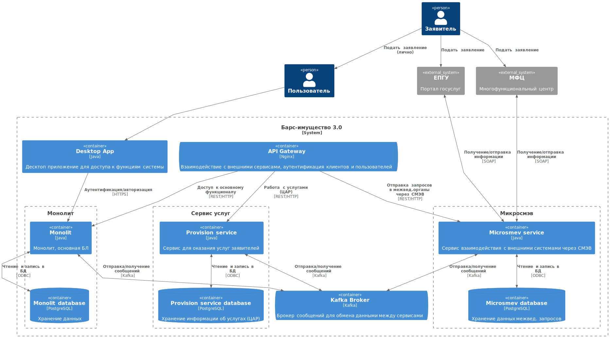

# Компонентная архитектура

## Обоснование выбора архитектурного стиля

Микросервисная архитектура является эффективным подходом для разработки приложений, которые должны масштабироваться и быть гибкими в изменении. В случае системы для оказания услуг, микросервисная архитектура может предоставить следующие преимущества:

- Гибкость: Микросервисы могут быть разработаны и развернуты независимо друг от друга, что позволяет быстро вносить изменения в приложение без необходимости перезапуска всего приложения.

- Масштабируемость: Микросервисы могут быть масштабированы отдельно друг от друга, что позволяет легко управлять нагрузкой на приложение и обеспечивать высокую доступность.

- Устойчивость: Если один из микросервисов не работает, остальные микросервисы могут продолжать работу, что обеспечивает устойчивость приложения в целом.

- Легкость разработки: Разработчики могут работать над отдельными микросервисами, что упрощает процесс разработки и тестирования.

- Легкость внедрения новых функций: Новые функции могут быть добавлены в виде новых микросервисов, что позволяет быстро внедрять новые возможности в приложение.

## Диаграмма компонентов

На диаграмме представлены компоненты микросервисной архитектуры системы и интеграции между данными компонентами.

## Описание компонентов

| № п/п | Тип             | Наименование                       | Технологии    | Описание                                                                                  |
| ----- | --------------- | ---------------------------------- | ------------- | ----------------------------------------------------------------------------------------- |
| 1     | Container       | Provision service                  | Java          | Сервис для оказания услуг заявителей                                                      |
| 2     | Container       | Provision service database         | PostgreSQL    | Хранение информации об услугах (ЦАР)                                                      |
| 3     | Container       | Monolit                            | Java          | Монолит, основная БЛ                                                                      |
| 4     | Container       | Monolit database                   | PostgreSQL    | Хранение данных                                                                           |
| 5     | Container       | Microsmev service                  | Java          | Сервис взаимодействия с внешними системами через СМЭВ                                     |
| 6     | Container       | Microsmev database                 | PostgreSQL    | Хранение данных межвед. запросов                                                          |
| 7     | Container       | Desktop App                        | Java          | Десктоп приложение для доступа к функциям системы                                         |
| 8     | Container       | API Gateway                        | Nginx         | Обеспечивает единую точку входа                                                           |
| 9     | Container       | Kafka Broker                       | Kafka         | Брокер сообщений для обмена данными между сервисами                                       |
| 10    | External system | ЕПГУ                               |               | Портал Госуслуг, для подачи заявлений                                                     |
| 11    | External system | МФЦ                                |               | Многофункциональный центр, для подачи заявлений                                           |