# Описание бизнес-процессов

## Взаимодействие заявителя с системой

На схеме представлены следующие бизнес-процессы:

- Подача заявления
- Получение результатов

## Взаимодействие пользователя с системой

На схеме представлены следующие бизнес-процессы:

- Загрузить ЦАР
- Оказать услугу (выполнить обращение)

