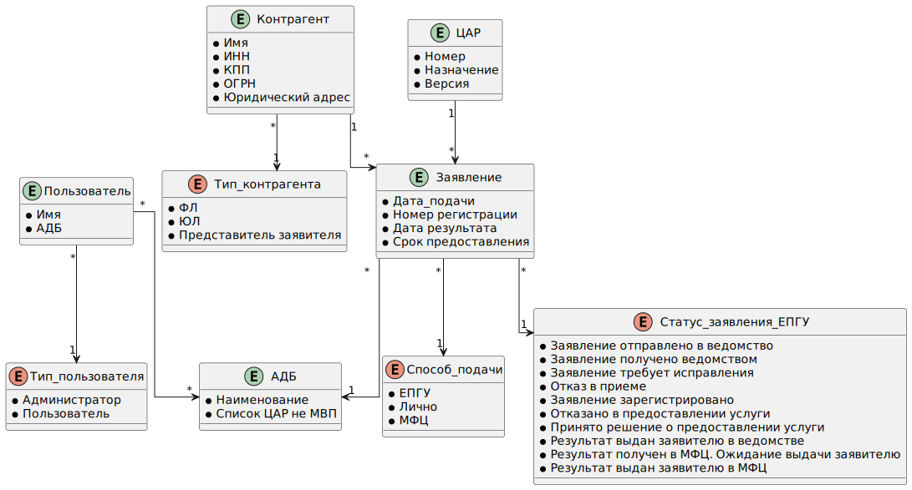

# Информационная модель

## Модель предметной области

В рамках MVP проекта были выделены основные сущности с атрибутами и определены связи между ними.

Базовыми сущностями являются:

- Пользователь
- Заявитель
- ЦАР
- Заявление

## Модель данных

