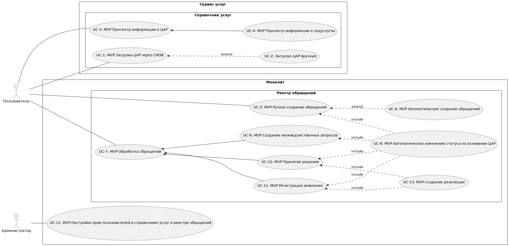

# Требования к системе

## Требования к системе в целом

### Производительность

**`NFPER1`** Система должна обеспечивать обработку заявлений не менее чем 1000 заявлений в день с возможностью масштабирования до 5000 заявлений в день в периоды повышенной активности.

**`NFPER2`** Время обработки заявления от момента подачи до вывода на рассмотрение не должно превышать 5 минут.

**`NFPER3`** При использовании пагинации для отображения больших объемов данных, система должна обеспечивать стабильную производительность, не уступающую времени обработки одного заявления.  

### Безопасность

**`NFSEC1`** Все данные, передаваемые между системой и ЕПГУ, должны быть защищены с использованием шифрования.  

**`NFSEC2`** Доступ к обращениям и ЦАР должен быть разграничен на основе ролей сотрудников и должен быть защищен от несанкционированного доступа.  

### Масштабируемость

**`NFEXT1`** Система должна быть способна масштабироваться для обработки увеличенного количества заявлений без значительного снижения производительности.

### Надежность

**`NFROB1`** Система должна иметь резервное копирование данных и механизмы восстановления после сбоев для обеспечения непрерывной работы.  

**`NFROB2`** Время недоступности системы не должно превышать 1 часа в месяц.

### Совместимость

**`NFCOM1`** Система должна быть совместима с семейством ОС Windows и части дистрибутивов Linux, которые входят в список отечественного ПО (попадают под импортозамещение). 

### Доступность

**`NFAVL1`** Система должна быть доступна 98% времени между 5:00 и полуночью по местному времени и 90% времени между полуночью и 5:00 по местному времени, за исключением времени планового обслуживания.

**`NFAVL2`** Допустимое время простоя в сутки не более 30 минут.

### Особенности хранения данных

**`NFDT1`** Данные заявлений должны храниться в соответствии с требованиями законодательства о защите персональных данных.  

### Концептуальная целостность

**`NFARC1`** Система должна соответствовать архитектурному стилю REST.

**`NFARC2`** Система должна обеспечивать целостность данных в процессе обработки заявлений на основании ЦАР.

### Поддерживаемость

**`NFSUP1`** Необходимо логировать действия пользователей в системе. Просмотр данных логов должен осуществляться через графический интерфейс. 

**`NFSUP2`** Система должна обеспечивать мониторинг работы и журналирование событий для обеспечения удобства поддержки и обнаружения проблем.

## Требования к функциям (задачам), выполняемым системой

### UseCase диаграмма

Основные функции системы представлены в виде UseCase диаграммы.  

### Описание UseCase, реализуемых в рамках MVP

#### Загрузка ЦАР через СМЭВ

| Название                                            | UC-1: Загрузка ЦАР через СМЭВ                                                                                                                                                                                                                                               |
|-----------------------------------------------------|-----------------------------------------------------------------------------------------------------------------------------------------------------------------------------------------------------------------------------------------------------------------------------|
| Краткое описание                                    | Создать новую карточу услуги в системе для получения возможности выполнять обращения                                                                                                                               															|
| Субъекты                                            | 1. Пользователь 2. Система                                                                                                                                                                                  															|
| Предусловие                                         | Пользователь зашел в Справочник услуг                                                                                                                                                                               															|
| Основной сценарий                                   | 1. Пользователь нажимает на кнопку N1.  2. Система выводит окно, в котором необходимо ввести номер ЦАР.  3. Пользователь вводит номер ЦАР и нажимает кнопку N2.  4. Система сообщает пользователю, что сообщение поставлено в очередь на обработку. |
| Наименования элементов пользовательского интерфейса | N1: “Запросить регламент”  N2: “Отправить”                                                                                                                                                                                                                              |
| Диаграмма                                           | { width="100" }  	                                                                                                                                                                                  											|

#### Загрузка ЦАР вручную

| Название                                            | UC-2: Загрузка ЦАР вручную                                                                                                                                                                                                                                                                                                                              |
|-----------------------------------------------------|---------------------------------------------------------------------------------------------------------------------------------------------------------------------------------------------------------------------------------------------------------------------------------------------------------------------------------------------------------|
| Краткое описание                                    | Создать новую карточу услуги в системе для получения возможности выполнять обращения                                                                                                                                                                                                                                                                       |
| Субъекты                                            | 1. Пользователь 2. Система                                                                                                                                                                                                                                                                                                                          |
| Предусловие                                         | Пользователь зашел в Справочник услуг                                                                                                                                                                                                                                                                                                                       |
| Основной сценарий                                   | 1. Пользователь нажимает на кнопку N1. 2. Открывается проводник ОС. 3. Пользователь выбирает ЦАР в формате xml. 4. Пользователь нажимает кнопку N2.     1. Если выбран xml файл, который не содержит информации о ЦАР - AF-1 5. Загрузка завершена. Система сообщает пользователю, что ЦАР успешно загружен в систему. Конец сценария.         |
| Альтернативный сценарий                             | AF1: Выбран некорректный xml файл.  1. Система выводит пользователю информационное сообщение о том, что выбран некорректный файл и кнопку N3.     2. Пользователь нажимает N3. Конец сценария. 																																					|
| Наименования элементов пользовательского интерфейса | N1: "Загрузить xml ЦАР" N2: "Открыть." N3: "Ок"                                                                                                                                                                                                                                                                                                 |
| Диаграмма                                           | { width="100" }                                                                                                                                                                                                                                                                                                         |

#### Просмотр информации о ЦАР

| Название                                            | UC-3: Просмотр информации об услуге                                                                                  |
| --------------------------------------------------- | -----------------------------------------------------------------------------------------------------------------|
| Краткое описание                                    | Просмотреть информацию об услуге                                                                                 |
| Субъекты                                            | 1\. Пользователь 2\. Система                                                                                  |
| Предусловие                                         | 1. Пользователь зашел в Справочник услуг 2. Пользователь выбрал запись с услугой 3. Выполнен сценарий UC-1 или UC-2                                                                                |
| Основной сценарий                                   | 1\. Пользователь нажимает на вкладку N1 2\. Система открывает вкладку с основной информацией. Конец сценария  |
| Наименования элементов пользовательского интерфейса | N1: "Услуга"                                                                                                     |
| Диаграмма                                           | { width="100" }                                                                                                                                                                                                                                                                                                         |

#### Просмотр информации о подуслугах

| Название                                            | UC-4: Просмотр информации о подуслугах                                                                                      |
| --------------------------------------------------- | --------------------------------------------------------------------------------------------------------------------------- |
| Краткое описание                                    | Просмотр информации о подуслугах (документы, этапы, структура)                                                              |
| Субъекты                                            | 1\. Пользователь 2\. Система                                                                                             |
| Предусловие                                         | 1. Пользователь зашел в Справочник услуг 2. Пользователь выбрал запись с услугой 3. Выполнен сценарий UC-1 или UC-2                                                                                            |
| Основной сценарий                                   | 1\. Пользователь нажимает на вкладку N1 2\. Система отображет информацию об подуслуге. Конец сценария                    |
| Наименования элементов пользовательского интерфейса | N1: "Подуслуга"                                                                                                             |
| Диаграмма                                           | { width="100" }                                                                                                                                                                                                                                                                                                         |

#### Ручное создание обращений

| Название                                            | UC-5: Ручное создание обращений                                                                                                                                                                                                                                                                                                                                                                                                   |
| --------------------------------------------------- | ----------------------------------------------------------------------------------------------------------------------------------------------------------------------------------------------------------------------------------------------------------------------------------------------------------------------------------------------------------------------------------------------------------------------------------|
| Краткое описание                                    | Ручное создание обращений для оказания услуги                                                                                                                                                                                                                                                                                                                                                                                     |
| Субъекты                                            | 1\. Пользователь 2\. Система                                                                                                                                                                                                                                                                                                                                                                                                   |
| Предусловие                                         | 1. Пользователь зашел в реестр обращений 2. Выполнен сценарий UC-1 или UC-2                                                                                                                                                                                                                                                                                                                                                                                             |
| Основной сценарий                                   | 1\. Пользователь нажимает кнопку N1. 2\. Система открывает окно создания обращений. 3\. Пользователь выбирает услугу. 4\. На основании выбранной услуги, система генерирует выпадающий список с подуслугами. 5\. Пользователь выбирает подуслугу 6\. На основании выбранной подуслуги система рисует поля для профилирования. 7\. Пользователь заполняет все поля и нажимает кнопку N2. 8\. Система сохраняет введеную информацию в БД. Конец сценария.                                                        |
| Наименования элементов пользовательского интерфейса | N1: "+" N2: "Сохранить"                                                                                                                                                                                                                                                                                                                                                                                                        |
| Диаграмма                                           | { width="100" }             																																																																																									  |

#### Автоматическое создание обращений

| Название                                            | UC-6: Автоматическое создание обращений                                                                                                                                                                                                                                                                                                                                                                                                          |
| --------------------------------------------------- | ----------------------------------------------------------------------------------------------------------------------------------------------------------------------------------------------------------------------------------------------------------------------------------------------------------------------------------------------------------------------------------------------------------------------------------|
| Краткое описание                                    | Автоматическое создание обращений для оказания услуги                                                                                                                                                                                                                                                                                                                                                                                            |
| Субъекты                                            | Система                                                                                                                                                                                                                                                                                                                                                                                                   |
| Предусловие                                         | Микросмэв получил информацию о заявлении из СМЭВ                                                                                                                                                                                                                                                                                                                                                                                             |
| Основной сценарий                                   | 1\. Микросмэв кидает вебхук в монолит. 2\. Монолит запрашивает список услуг и подуслуг у сервиса услуг. 3\. Сервис услуг отдает информацию. 4\. Монолит обрабатывает информацию. Конец сценария.|
| Диаграмма                                           | { width="100" }             																																																																																									  |

#### Обработка обращений

| Название                                            | UC-7: Обработка обращений                                                                                                                                                                                                                                                                                                                          |
|-----------------------------------------------------|----------------------------------------------------------------------------------------------------------------------------------------------------------------------------------------------------------------------------------------------------------------------------------------------------------------------------------------------------|
| Краткое описание                                    | Обработка обращений с целью оказания услуги заявителю                                                                                                                                                                                                                                                                                              |
| Субъекты                                            | 1. Пользователь 2. Система                                                                                                                                                                                                                                                                                                                     |
| Предусловие                                         | 1. Пользователь зашел в реестр обращений 2. Создано обращение в рамках UC-5 или UC-6 3. Пользователь выбрал запись с обращением                                                                                                                                                                                                                                                            |
| Основной сценарий                                   | 1. Пользователь нажимает на вкладку N1, выполнение сценария UC-11 2. Пользователь нажимает кнопку N2. 3. Система добавляет новую вкладку N3. 4. Пользователь переходит на вкладку N3, выполнение сценария UC-9. 5. Пользователь нажимает кнопку N4. 6. Система добавляет вкладку N5, пользователь нажимает на вкладку N5. Выполнение сценария UC-10. Конец сценария.   |
| Наименования элементов пользовательского интерфейса | N1: "Прием заявления"  N2: "Зарегистрировать"  N3: "Межведомственное взаимодействие"  N4: "Принять решение" N5: "Предоставление результата"                                                                                                                                                                                                                 |

#### Автоматическое изменение статуса на основании ЦАР  

| Название                                            | UC-8: Автоматическое изменение статуса на основании ЦАР                                                                                                                                                                                                                                                                                                                                                   |
|-----------------------------------------------------|---------------------------------------------------------------------------------------------------------------------------------------------------------------------------------------------------------------------------------------------------------------------------------------------------------------------------------------------------------------------------------------------|
| Краткое описание                                    | Автоматическое изменение статусов заявления на основании ЦАР                                                                                                                                                                                                                                                                                                                    |
| Субъекты                                            | Система                                                                                                                                                                                                                                                                                                                                                              |
| Предусловие                                         | Выполялись сценарии UC-5, UC-6, UC-9, UC-10 или UC-11                                                                                                                                                                                                                                                                                                                                                       |
| Основной сценарий                                   | 1. Монолит получает список событий у сервиса услуг. 2. Монолит отправляет запрос в микросмэв для смены статусов. 3. Микросмэв возвращает 200. 4. Монолит меняет статус записи в БД. Конец сценария.                         |
| Диаграмма                                           | { width="100" }                                             	                                                                                                                                                       	                                                                                                                                |

#### Создание межведомственных запросов  

| Название                                            | UC-9: Создание межведомственных запросов                                                                                                                                                                                                                                                                                                                                                   |
|-----------------------------------------------------|---------------------------------------------------------------------------------------------------------------------------------------------------------------------------------------------------------------------------------------------------------------------------------------------------------------------------------------------------------------------------------------------|
| Краткое описание                                    | Создание межведомственных запросов для проведения документарной проверки                                                                                                                                                                                                                                                                                                                    |
| Субъекты                                            | 1. Пользователь 2. Система                                                                                                                                                                                                                                                                                                                                                              |
| Предусловие                                         | 1. Пользователь зашел в реестр обращений 2. Пользователь выбрал запись с обращением 3. Выполнены сценарии UC-5, UC-6 и UC-11                                                                                                                                                                                                                                                                                                                                                    |
| Основной сценарий                                   | 1. Пользователь перешел на вкладку N1. 2. Монолит обращается к сервису услуг за всей информацией по этапу межведомственное взаимодействие.  1. Если в системе есть ВС и настроено автоматическая отправка запросов - AF-1  2. Если в системе нет насторенного ВС - AF-2 3. Пользователь нажимает кнопку N3. Кнопка N3 временно блокируется 4. Монолит передает информацию для отправки данных в микросмэв. 5. Монолит меняет статус запроса. Разблокируется кнопка N2. 6. Система отрисовывает кнопку N4. Пользователь нажимает на кнопку N4. Сценарий UC-8.  Конец сценария.                         |
| Альтернативный сценарий                             | AF1: Запросы направлены автоматически.  1. Система автоматически создает и отправлять межведомственные запросы. 2. Переход к п.4 основного сценария. Конец сценария. AF2: В системе нет настроенного ВС.  1. Система выводит информацию пользователю о том, что по данному ВС необходимо обратиться лично  2. Переход к п.6 основного сценария. Конец сценария.                                                                                                                                                                                                                 |
| Наименования элементов пользовательского интерфейса | N1: "Межведомственное взаимодействие" N2: "Переход" N3: "Запрос" N4: "Принять решение"                                                                                                                                                                                                                                                                                 |
| Диаграмма                                           | { width="100" }                                             	                                                                                                                                                       	                                                                                                                                |

#### Принятие решения  

| Название                                            | UC-10: Принятие решения                                                                                                                                                                                                                                                                                                                                                   |
|-----------------------------------------------------|---------------------------------------------------------------------------------------------------------------------------------------------------------------------------------------------------------------------------------------------------------------------------------------------------------------------------------------------------------------------------------------------|
| Краткое описание                                    | Принятие решения для оказания услуги                                                                                                                                                                                                                                                                                                                    |
| Субъекты                                            | 1. Пользователь 2. Система                                                                                                                                                                                                                                                                                                                                                              |
| Предусловие                                         | 1. Пользователь зашел в реестр обращений 2. Пользователь выбрал запись с обращением 3. Выполнены сценарии UC-5, UC-6, UC-9 и UC-11                                                                                                                                                                                                                                                                                                                                                      |
| Основной сценарий                                   | 1. Пользователь перешел на вкладку N1. 2. Монолит обращается к сервису услуг за всей информацией по этапу предоставление результата. 3. Пользователь нажимает кнопку N2 или N3 Выполняется сценарий UC-8. 4. Завершение этапа, переход в сценарий UC-13. Конец сценария.                         |
| Наименования элементов пользовательского интерфейса | N1: "Предоставление результата" N2: "Оказать услугу" N3: "Отказ"                                                                                                                                                                                                                                                                                 |
| Диаграмма                                           | { width="100" }                                             	                                                                                                                                                       	                                                                                                                                |

#### Регистрация заявления  

| Название                                            | UC-11: Регистрация заявления                                                                                                                                                                                                                                                                                                                                                   |
|-----------------------------------------------------|---------------------------------------------------------------------------------------------------------------------------------------------------------------------------------------------------------------------------------------------------------------------------------------------------------------------------------------------------------------------------------------------|
| Краткое описание                                    | Регистрация заявления для дальнейшей обработки                                                                                                                                                                                                                                                                                                                    |
| Субъекты                                            | 1. Пользователь 2. Система                                                                                                                                                                                                                                                                                                                                                              |
| Предусловие                                         | 1. Пользователь зашел в реестр обращений 2. Выполнен основной сценарий UC-5 или UC-6 3. Пользователь выбрал запись с обращением                                                                                                                                                                                                                                                                                                                                                       |
| Основной сценарий                                   | 1. Пользователь перешел на вкладку N1. 2. Монолит обращается к сервису услуг за всей информацией по этапу прием заявления. 3. Пользователь нажимает кнопку N2. Выполняется сценарий UC-8 1. Если пользователь нажимает на кнопку N3 - AF-1 2. Если пользователь нажимает на кнопку N4 - AF-2 4. Завершение этапа, переход в сценарий UC-9. Конец сценария.                         |
| Альтернативный сценарий                             | AF1: Отказ в регистрации заявления.  1. Выполняется сценарий UC-8. 2. Завершение этапа, переход в сценарий UC-13. Конец сценария. AF2: Перенапривить обращение в другое ведомство. 1. Пользователь выбирает АДБ 2. Выполняется сценарий UC-8. Конец сценария.                                                                                                                                                                                                                |
| Наименования элементов пользовательского интерфейса | N1: "Прием заявлений" N2: "Зарегистрировать" N3: "Отказать" N4: "Перенаправить"                                                                                                                                                                                                                                                                                 |
| Диаграмма                                           | { width="100" }                                             	                                                                                                                                                       	                                                                                                                                |

#### Настройка прав пользователей

| Название                                            | UC-12: Настройка прав пользователей                                                                                                                                                                                                                                                                                                                                  |
| --------------------------------------------------- | -------------------------------------------------------------------------------------------------------------------------------------------------------------------------------------------------------------------------------------------------------------------------------------------------------------------------------------------------------------------------------------|
| Краткое описание                                    | Настройка прав пользователей в справочнике услуг и реестре обращений                                                                                                                                                                                                                                                                                                                    |
| Субъекты                                            | 1\. Администратор 2\. Система                                                                                                                                                                                                                                                                                                                                                     |
| Предусловие                                         | 1. Создана учетная запись администратора 2. Создана учетная запись пользователя 3. Администратор открыл меню с настройкой прав доступа пользователей                                                                                                                                                                                                                                                                                                         |
| Основной сценарий                                   | 1\. Администратор выбирает пользователя, для которого хочет выполнить настройку прав. 2\. Система отрисовывает в правой части меню Типы операций и Типы элементов реестра. 3\. Администратор настраивает CRUD и сохраняет права для пользователя. 4\. Система применяет настройки. Конец сценария.|
| Типы регулируемых прав                              | 1\. CRUD. 2\. Тип оперции - "Загрузка ЦАР". 3\. Тип операции - "Запрос ЦАР".                                                                                                                                                                                                                                                                                                   |

#### Создание резолюции

| Название                                            | UC-13: Создание резолюции                                                                                                                                                                                                                                                                                                                                  |
| --------------------------------------------------- | -------------------------------------------------------------------------------------------------------------------------------------------------------------------------------------------------------------------------------------------------------------------------------------------------------------------------------------------------------------------------------------|
| Краткое описание                                    | Создание документа с результатом оказания услуги                                                                                                                                                                                                                                                                                                                    |
| Субъекты                                            | 1\. Пользователь 2\. Система                                                                                                                                                                                                                                                                                                                                                     |
| Предусловие                                         | Пользователь нажал на кнопку "Отказать" в рамках UC-11 Пользователь нажал кнопку "Оказать услугу" или "Отказ" в рамках UC-10                                                                                                                                                                                                                                                                                                         |
| Основной сценарий                                   | 1\. Система отрисовывает окно с параметром резолюции. 2\. Пользователь заполняет поля, нажимает кнопку N1. 3\. Система возвращает сформированное окно с телом резолюции. 4\. Пользователь нажимает кнопку N2. 1\. Если пользователь нажимает на кнопку N3 - AF-1 5\. Система сохраняет резолюцию. Выполняется сценарий UC-8. Конец сценария.|
| Альтернативный сценарий                             | AF1: Отмена подтверждения резолюции.  1. Система отрисовывает окно с параметрами резолюции - шаг 1. Конец сценария.                                                                                                                                                                                                                |
| Наименования элементов пользовательского интерфейса | N1: "Создать" N2: "Ок" N3: "Отмена"                                                                                                                                                                                                                                                                                 |
| Диаграмма                                           | { width="100" }                                             	                                                                                                                                                       	                                                                                                                                |
